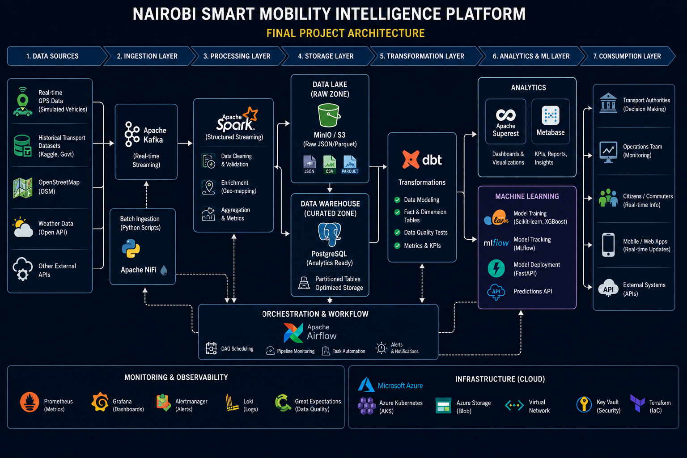

# Nairobi Smart Mobility Intelligence Platform

## Architecture

## Overview

The Nairobi Smart Mobility Intelligence Platform is an end-to-end data platform designed to ingest, process, analyze, and predict urban transport activity in Nairobi using streaming data, big data technologies, cloud infrastructure, and machine learning.

# Architecture Decisions

## ADR-001
Decision: Use Kafka as the streaming layer.

Reason:
Supports real-time transport events and scales easily.

---

## ADR-002
Decision: Use PostgreSQL as the warehouse.

Reason:
Simple to set up, widely used, and sufficient for project scale.

---

## ADR-003
Decision: Use Spark Structured Streaming.

Reason:
Supports both batch and streaming workloads.